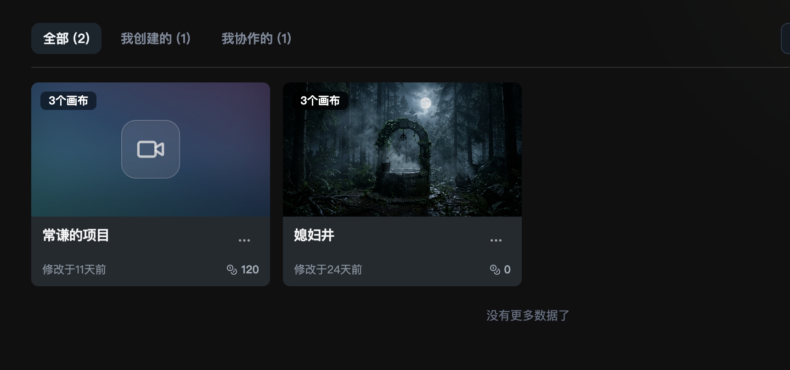
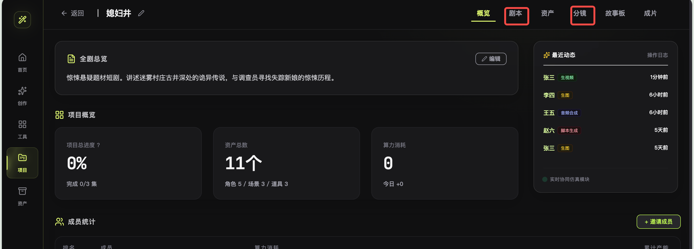
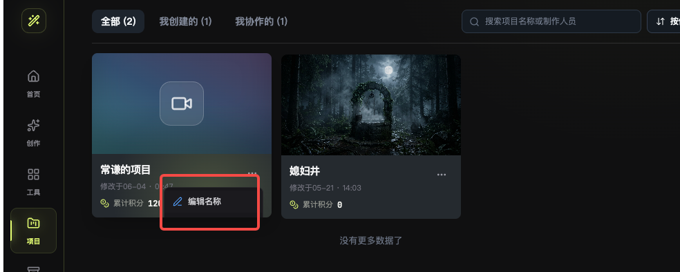
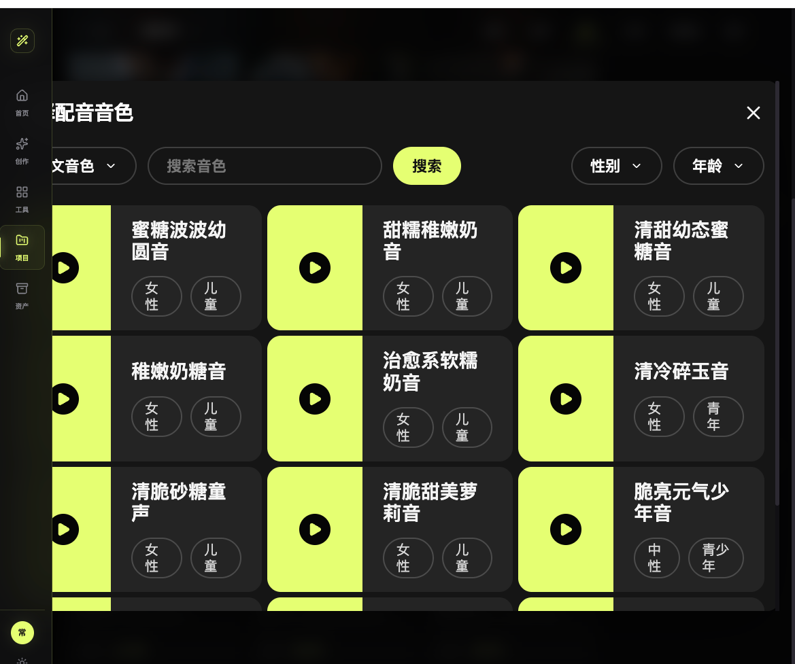

# 漫剧创作平台 PRD V1.2

## 一、版本信息

| 项目 | 内容 |
| --- | --- |
| 产品名称 | 漫剧创作平台 |
| 文档版本 | V1.2 |
| 编写日期 | 2026-06-23 |
| 适用端 | Web 工作台 |
| 目标用户 | 漫剧创作者、短剧制作团队、AI 视频运营、项目协作者 |
| 本期目标 | 统一剧本模式与自由模式的成片工作台，建立暗房霓虹设计系统，完善项目列表、资产、分镜、配音与成片链路的交互闭环与可访问性 |

### 1.1 版本目标

本版本围绕 AI 漫剧制作工作台进行产品化优化，统一双模式成片页面逻辑，建立完整的暗房霓虹设计系统（Moss Lime 主色 + Sora/Hanken Grotesk 字体），补全删除确认模态、配音筛选、创建表单等核心功能闭环，并全面对齐 WCAG 可访问性规范。

### 1.2 本期范围

| 模块 | 范围 |
| --- | --- |
| 设计系统 | 暗房霓虹品牌、Moss Lime 主色、Sora/Hanken Grotesk/JetBrains Mono 字体、语义 Token、暗色/亮色双主题 |
| 项目列表 | 项目卡片、项目筛选、创建项目（含项目简介）、更多操作、删除确认模态 |
| 创建项目 | 剧本模式、自由模式、剧本上传、集数填写、项目简介、防重复提交 |
| 项目详情 | 顶部 Tab（ARIA tablist 语义）、概览、资产、分镜、成片 |
| 资产管理 | 角色、场景、道具、音色绑定、资产提取引导 |
| 分镜制作 | 集数切换、分镜编辑、提示词、视频生成 |
| 成片流程 | 统一工作台（集数导航 + 播放器 + 模块 Tab + 时间轴 + 导出） |
| 配音弹窗 | 语言/搜索/性别/年龄四维筛选、空状态、重置 |
| 可访问性 | focus-visible、prefers-reduced-motion、ARIA tablist、图标按钮 aria-label |

### 1.3 本期不做

| 项目 | 说明 |
| --- | --- |
| 真实 AI 生成接口 | 本期以前端交互与流程闭环为主，接口接入另行评审 |
| 支付与计费系统 | 仅展示累计积分与消耗信息 |
| 多团队权限体系 | 本期仅覆盖项目内协作成员展示与邀请入口 |
| 复杂审批流 | 资产确认、分镜确认暂不接入审批 |
| Agent 生产进度模块 | 本期已移除概览页 Agent 生产进度可视化，后续版本视接口能力再评估 |

### 1.4 关键结果

1. 用户能在 10 秒内理解剧本模式与自由模式的差异。
2. 剧本模式与自由模式的成片页面结构、交互、功能完全一致。
3. 项目卡片、配音弹窗、更多操作菜单展示完整，符合暗房霓虹设计系统。
4. 删除项目使用自定义危险确认模态，替代原生 confirm 弹窗。
5. 配音弹窗四维筛选器全部生效，支持空状态与重置。
6. 全站颜色、字体、圆角、间距统一为设计 Token，无硬编码值。
7. 键盘导航、焦点可见、减弱动效等可访问性要求达标。

## 二、变更日志

| 日期 | 版本 | 变更人 | 变更内容 |
| --- | --- | --- | --- |
| 2026-06-15 | V1.0 | 产品 | 初版 PRD，定义项目列表、创建项目、资产与分镜基础流程 |
| 2026-06-15 | V1.1 | 产品 | 补充漫剧制作业务流程、双模式差异、Agent 生产进度、截图说明与验收标准 |
| 2026-06-23 | V1.2 | 产品 | 移除 Agent 生产进度模块；统一双模式成片工作台；建立暗房霓虹设计系统；补全删除确认模态、配音四维筛选、创建表单项目简介与防重复提交；新增可访问性规范（ARIA tablist、focus-visible、prefers-reduced-motion） |

## 三、文档说明

### 3.1 名词解释

| 名词 | 定义 |
| --- | --- |
| 漫剧 | 以漫画、插画或 AI 视频片段为核心表现形式，结合字幕、配音、音效生成的连续短剧内容 |
| 剧本模式 | 用户上传剧本，由 Agent 自动解析剧本、提取资产、生成分镜并推动成片 |
| 自由模式 | 用户不上传剧本，直接通过集数、角色、场景、道具和分镜进行自由创作 |
| Agent | 平台内承担某一生产任务的 AI 工作单元，例如剧本解析 Agent、资产生成 Agent |
| 资产 | 漫剧制作所需的角色、场景、道具、音色、参考图等基础素材 |
| 分镜 | 按集数组织的镜头描述、出镜角色、场景、提示词与视频生成配置 |
| 成片 | 分镜视频、配音、字幕、音乐合成为可预览和导出的剧集 |

### 3.2 用户角色

| 角色 | 主要诉求 | 权限说明 |
| --- | --- | --- |
| 项目创建者 | 创建项目、配置模式、管理资产、生成分镜与成片 | 拥有项目编辑、删除、邀请成员权限 |
| 协作者 | 参与资产制作、分镜编辑、视频生成 | 可查看和编辑被授权项目 |
| 运营/审核人员 | 查看进度、检查产出、导出成片 | 可查看项目进度与成片结果 |

## 四、产品原型

### 4.1 产品架构

流程说明：项目列表 → 创建项目 → 选择创作模式。剧本模式进入上传剧本、剧本解析、资产生成、分镜生成、成片合成；自由模式进入填写集数、手动创建资产、自由编排分镜、成片合成。

### 4.2 业务流程

#### 4.2.1 剧本模式流程

1. 创建项目。
2. 选择剧本模式。
3. 上传剧本文档。
4. 进入剧本 Tab。
5. 剧本解析 Agent 拆章节、场景、对白。
6. 资产生成 Agent 提取角色、场景、道具。
7. 分镜生成 Agent 生成镜头表和提示词。
8. 成片合成 Agent 生成视频、配音、字幕。
9. 用户预览与导出。

#### 4.2.2 自由模式流程

1. 创建项目。
2. 选择自由模式。
3. 输入集数。
4. 进入概览。
5. 手动创建角色、场景、道具、音色。
6. 在分镜中按集数编排镜头。
7. 生成分镜视频。
8. 合成成片。

### 4.3 关键页面截图

#### 图 1：项目列表卡片

说明：

1. 页面顶部提供 全部、我创建的、我协作的 三个项目筛选。
2. 项目卡片采用封面结构：上方封面图，下方项目信息区。
3. 封面左上角显示项目集数，例如 3集。
4. 信息区展示项目名称、修改时间、累计积分。
5. 更多操作入口保留，用于编辑名称、邀请分享、删除项目。

#### 图 2：项目详情顶部 Tab

说明：

1. 项目详情页顶部展示项目名称、返回入口、编辑名称入口。
2. 剧本模式展示：概览 / 剧本 / 资产 / 分镜 / 成片。
3. 自由模式展示：概览 / 资产 / 分镜 / 成片。
4. 自由模式不展示剧本 Tab，不触发剧本解析相关流程。
5. 当前选中 Tab 以亮色文字和底部高亮线展示。

#### 图 3：项目更多操作菜单

说明：

1. 点击卡片更多操作后展示菜单。
2. 菜单项包含：编辑名称、邀请分享、删除项目。
3. 菜单必须完整展示，不允许被卡片容器裁切。
4. 删除操作必须二次确认。

#### 图 4：配音音色弹窗

说明：

1. 角色资产支持绑定音色。
2. 点击选择音色后打开配音音色弹窗。
3. 弹窗支持语言、搜索、性别、年龄筛选。
4. 音色卡片展示播放按钮、音色名称、性别、年龄。
5. 选择音色后回填至角色卡片，并展示已绑定图标。

## 五、需求说明

## 5.1 项目列表

| 模块 | 功能详细说明 |
| --- | --- |
| 菜单路径与入口 | 左侧导航 项目 进入项目列表页 |
| 功能目标 | 让用户快速查看已有漫剧项目，并进入编辑、创建、协作与管理操作 |
| 筛选 Tab | 默认选中全部；支持切换我创建的、我协作的；Tab 右侧展示数量 |
| 搜索 | 支持按项目名称、协作成员搜索；输入为空时展示全部结果 |
| 项目卡片 | 展示封面、集数、项目名、修改时间、累计积分、更多操作 |
| 卡片点击 | 点击封面或标题进入项目详情页 |
| 更多操作 | 点击更多操作展示菜单：编辑名称、邀请分享、删除项目 |
| 空状态 | 无项目时展示创建引导；搜索无结果时提示调整关键词 |

### 5.1.1 项目卡片字段

| 字段 | 控件/展示 | 规则 |
| --- | --- | --- |
| 封面图 | 图片/渐变占位 | 有封面图展示图片；无封面图展示渐变占位 |
| 集数 | 左上角角标 | 格式为 N集，N 来源于项目 episodesCount |
| 项目名称 | 文本 | 单行展示，超出省略 |
| 修改时间 | 文本 | 展示为 修改于X天前 |
| 累计积分 | 文本+图标 | 展示项目 computeSpent |

### 5.1.2 验收标准

1. 项目卡片左上角必须展示 N集，不能展示为 N个画布。
2. 更多操作菜单展示完整，不被容器裁切。
3. 删除项目时必须出现确认提示。
4. 搜索和 Tab 筛选可同时生效。

## 5.2 创建项目

| 模块 | 功能详细说明 |
| --- | --- |
| 入口 | 项目列表右上角 + 创建项目 |
| 项目名称 | 必填，建议 1-30 字 |
| 项目简介 | 非必填，用于概览页全剧总览 |
| 创作模式 | 单选：剧本模式、自由模式 |
| 剧本模式 | 必须上传剧本文档后才允许创建 |
| 自由模式 | 必须填写集数，集数最小为 1 |
| 创建成功 | 新项目插入列表首位，并自动进入项目详情 |

### 5.2.1 创建规则

| 模式 | 必填字段 | 创建后默认进入 | 顶部 Tab |
| --- | --- | --- | --- |
| 剧本模式 | 项目名称、剧本文档 | 剧本 | 概览 / 剧本 / 资产 / 分镜 / 成片 |
| 自由模式 | 项目名称、集数 | 概览 | 概览 / 资产 / 分镜 / 成片 |

### 5.2.2 异常规则

1. 未填写项目名称时，不允许提交。
2. 剧本模式未上传剧本时，创建按钮置灰。
3. 自由模式集数小于 1 时，创建按钮置灰或提示错误。
4. 重复点击创建时，需防重复提交（isSubmitting 锁定，按钮显示"创建中…"）。

## 5.3 项目详情与模式化 Tab

| 模块 | 功能详细说明 |
| --- | --- |
| 页面入口 | 项目列表点击卡片进入 |
| 顶部信息 | 返回、项目名称、重命名、Tab 导航 |
| 剧本模式 Tab | 概览 / 剧本 / 资产 / 分镜 / 成片 |
| 自由模式 Tab | 概览 / 资产 / 分镜 / 成片 |
| Tab 状态 | 当前 Tab 高亮；切换时展示对应页面内容 |
| 可访问性 | Tab 导航使用 ARIA tablist/tabpanel 语义；支持左右箭头键盘切换；aria-selected 标记当前 Tab |
| 资产 Tab 交互 | 切换到资产 Tab 时先切换页面，再根据状态展示提取入口（不再强制拦截） |

### 5.3.1 剧本模式

剧本模式以剧本驱动为核心。用户上传剧本后，系统通过 Agent 自动拆解内容，并推动资产、分镜和成片生产。

保留能力：剧本解析、Agent 资产提取、自动生成资产卡、分镜生成、成片合成。

### 5.3.2 自由模式

自由模式以资产和分镜驱动为核心。用户无需上传剧本，可直接搭建角色、场景、道具和音色，然后自由编排分镜。

隐藏能力：剧本 Tab、剧本解析 Agent、Agent 资产提取弹窗。

保留能力：概览、手动资产创建、分镜编辑、成片合成。

## 5.4 概览页

| 模块 | 功能详细说明 |
| --- | --- |
| 入口 | 项目详情默认 Tab 概览 |
| 功能目标 | 让用户快速掌握项目基本信息、资产规模、成员协作与积分消耗 |
| 展示区域 | 项目概览统计卡片、资产统计、成员统计 |

### 5.4.1 概览页内容区块

| 区块 | 说明 |
| --- | --- |
| 项目概览统计 | 展示项目模式、集数、资产总数、累计积分、今日消耗 |
| 资产统计 | 按角色、场景、道具分类展示资产数量与状态 |
| 成员统计 | 展示项目协作成员列表与角色 |

### 5.4.2 双模式差异

| 模式 | 概览页差异 |
| --- | --- |
| 剧本模式 | 展示剧本文件名、解析状态；概览统计包含剧本相关字段 |
| 自由模式 | 不展示剧本相关字段；统计卡片聚焦资产与分镜 |

验收标准：

1. 概览页必须展示项目模式、集数、资产总数、累计积分。
2. 剧本模式概览页展示剧本文件名，自由模式不展示。
3. 统计卡片数据与实际资产、成员数量一致。

## 5.5 剧本 Tab

| 模块 | 功能详细说明 |
| --- | --- |
| 适用模式 | 仅剧本模式 |
| 页面结构 | 左侧章节列表，中间剧本编辑区，右侧全局设定 |
| 章节列表 | 展示 Agent 提取的章节，可新增章节 |
| 剧本编辑 | 支持编辑章节内容，展示字数 |
| 全局设定 | 视频比例、创作模式、风格参考、导演设定 |
| 提取资产 | 点击提取资产打开资产提取弹窗 |

验收标准：

1. 自由模式不展示剧本 Tab。
2. 剧本模式进入剧本 Tab 时显示解析中状态。
3. 剧本内容修改后页面保留当前输入。

## 5.6 资产 Tab

| 模块 | 功能详细说明 |
| --- | --- |
| 适用模式 | 剧本模式、自由模式 |
| 资产类型 | 角色、场景、道具 |
| 筛选 | 全部、角色、场景、道具 |
| 资产卡 | 图片、名称、描述、状态、操作按钮 |
| 角色音色 | 支持上传音频或选择音色 |

### 5.6.1 剧本模式资产页

1. 可展示 Agent 从剧本中提取的角色、场景、道具。
2. 若未完成提取，点击资产 Tab 可触发资产提取弹窗。
3. 提取完成后，可批量生成资产。

### 5.6.2 自由模式资产页

1. 不展示 Agent 资产提取入口。
2. 页面文案提示用户手动创建角色、场景、道具、音色。
3. 显示新增资产操作入口。
4. 后续分镜可引用已创建资产。

验收标准：

1. 自由模式点击资产 Tab 不弹出 Agent 提取弹窗。
2. 剧本模式可通过资产提取流程生成资产。
3. 角色音色绑定后，角色卡展示已绑定音色和图标。

## 5.7 配音音色弹窗

| 模块 | 功能详细说明 |
| --- | --- |
| 入口 | 角色卡片中的选择音色 |
| 弹窗标题 | 选择配音音色 |
| 筛选项 | 语言、关键词、性别、年龄 |
| 音色卡片 | 播放按钮、音色名称、性别、年龄 |
| 选择结果 | 点击音色卡后关闭弹窗，并绑定到角色 |

### 5.7.1 字段规则

| 字段 | 控件 | 规则 |
| --- | --- | --- |
| 语言 | 下拉 | 默认中文音色 |
| 搜索音色 | 输入框 | 支持按音色名称搜索 |
| 性别 | 下拉 | 不限、男性、女性、中性 |
| 年龄 | 下拉 | 不限、儿童、青少年、青年、中年、老年 |

### 5.7.2 异常与边界

1. 无搜索结果时展示空状态，包含提示文案与"重置筛选"按钮。
2. 点击"重置筛选"清空所有筛选条件，恢复展示全部音色。
3. 弹窗宽度需适配工作台，不得被侧边栏遮挡。
4. 窄屏时音色卡片单列展示。
5. 四个筛选器（语言、搜索、性别、年龄）可组合生效，实时过滤音色列表。

## 5.8 分镜 Tab

| 模块 | 功能详细说明 |
| --- | --- |
| 适用模式 | 剧本模式、自由模式 |
| 集数切换 | 左侧展示项目集数，点击切换当前集 |
| 分镜列表 | 展示分镜编号、描述、出镜角色、场景、道具 |
| 视频生成 | 支持模型选择、时长、速度、生成按钮 |
| 批量生成 | 支持批量生成当前集分镜视频 |

### 5.8.1 剧本模式分镜

1. 分镜可由剧本解析结果生成。
2. 默认带入角色、场景、对白与提示词。
3. 用户可编辑镜头描述和生成提示词。

### 5.8.2 自由模式分镜

1. 用户手动新增分镜。
2. 支持从资产库引用角色、场景、道具和音色。
3. 分镜不依赖剧本文本。

验收标准：

1. 分镜描述输入后不丢失。
2. 点击角色、场景、道具引用后，提示词区域追加对应引用。
3. 生成后预览区状态更新为已生成。

## 5.9 成片 Tab

| 模块 | 功能详细说明 |
| --- | --- |
| 适用模式 | 剧本模式、自由模式（双模式结构完全一致） |
| 功能目标 | 将分镜视频、配音、字幕和音乐合成为完整剧集，支持预览与导出 |
| 页面布局 | 左侧集数导航栏 + 右侧主工作区（全宽出血布局） |
| 主工作区 | 顶部操作栏 + 播放器卡片 + 模块 Tab + 时间轴 + 模块面板 |

### 5.9.1 统一工作台结构

| 区域 | 说明 |
| --- | --- |
| 集数导航栏 | 左侧纵向展示集数列表，点击切换当前集，激活态高亮 |
| 顶部操作栏 | 展示"成片预览"标题、当前集数与分镜信息；右侧提供导出、下载视频按钮 |
| 播放器卡片 | 视频预览舞台 + 播放控件（进度时间、上一段/播放/下一段） |
| 模块 Tab | 分镜视频 / 配音 / 配字幕 三个模块切换 |
| 时间轴 | 时间标尺 + 分镜轨道（4 段分镜，点击切换到分镜视频模块） |
| 模块面板 | 根据当前模块展示对应操作入口与说明 |

### 5.9.2 模块面板说明

| 模块 | 面板内容 |
| --- | --- |
| 分镜视频 | 查看当前集分镜片段，支持逐段生成、编辑和替换；提供"生成当前分镜视频"入口 |
| 配音 | 为角色对白绑定音色，生成旁白和对白音轨；提供"进入配音"入口 |
| 配字幕 | 编辑字幕文本、时间轴和字幕样式；提供"进入配字幕"入口 |

### 5.9.3 双模式一致性

剧本模式与自由模式的成片页面结构、交互、功能完全一致，均使用统一工作台。自由模式不再使用独立的简易播放器。

### 5.9.4 合成前置校验

| 校验项 | 规则 |
| --- | --- |
| 分镜视频 | 至少存在 1 条已生成视频 |
| 角色音色 | 存在对白角色时必须绑定音色 |
| 字幕 | 可自动生成，失败时允许重试 |
| BGM | 可为空，但需提示用户 |

验收标准：

1. 剧本模式与自由模式成片页面结构完全一致。
2. 集数导航栏可切换集数，播放器与时间轴同步更新。
3. 模块 Tab 切换时模块面板内容正确联动。
4. 导出和下载视频按钮可点击。
5. 成片页面主色调与项目主色调（Moss Lime）一致，适配暗色主题。

## 5.10 邀请分享与删除

| 模块 | 功能详细说明 |
| --- | --- |
| 入口 | 项目卡片更多操作菜单 |
| 邀请分享 | 打开成员邀请弹窗，选择成员后确认邀请 |
| 删除项目 | 自定义危险确认模态，二次确认后删除项目 |
| 编辑名称 | 打开重命名弹窗，保存后回显 |

### 5.10.1 删除确认模态

| 元素 | 说明 |
| --- | --- |
| 危险图标 | 红色警告图标，提示操作不可逆 |
| 标题 | "确认删除项目" |
| 警告文案 | 明确告知项目将被永久删除且不可撤销 |
| 取消按钮 | 关闭模态，不执行删除 |
| 确认按钮 | 红色危险样式，点击后执行删除 |

验收标准：

1. 删除项目必须使用自定义危险确认模态，不得使用原生 confirm 弹窗。
2. 模态包含危险图标、不可撤销警告文案、取消与确认双按钮。
3. 邀请成员后，项目成员数量更新。
4. 删除后项目从列表移除。
5. 重命名后项目卡和详情页同步显示新名称。

## 六、物料模板/附录

### 6.1 状态枚举

| 状态类型 | 枚举 |
| --- | --- |
| 项目模式 | 剧本模式、自由模式 |
| 项目 Tab | 概览、剧本、资产、分镜、成片 |
| 资产状态 | 待生成、已设定 |
| 分镜状态 | 未生成、生成中、已生成、失败 |
| 成片模块 | 分镜视频、配音、配字幕 |

### 6.2 数据字典

| 字段 | 类型 | 说明 |
| --- | --- | --- |
| project.id | string | 项目 ID |
| project.name | string | 项目名称 |
| project.projectType | enum | 剧本模式/自由模式 |
| project.episodesCount | number | 集数 |
| project.computeSpent | number | 累计积分 |
| project.assets.total | number | 资产总数 |
| project.scriptFileName | string | 上传剧本文件名 |
| episode.progress | number | 剧集进度，0-100 |

### 6.3 埋点建议

| 事件 | 触发时机 | 关键属性 |
| --- | --- | --- |
| create_project_click | 点击创建项目 | user_id |
| create_project_success | 创建成功 | project_type、episodes_count |
| project_tab_click | 点击顶部 Tab | project_type、tab_name |
| agent_extract_start | 开始资产提取 | project_id |
| voice_bind_success | 音色绑定成功 | role_id、voice_id |
| storyboard_generate_click | 点击生成分镜视频 | model、duration、speed |
| render_export_click | 点击导出成片 | project_id、episode_count |

### 6.4 非功能要求

| 项目 | 要求 |
| --- | --- |
| 设计系统 | 暗房霓虹品牌；主色 Moss Lime `#c0cf62` / 霓虹莱姆 `#d9f43c`；字体 Sora（标题）/ Hanken Grotesk（正文）/ JetBrains Mono（数据）；全站使用语义 Token，无硬编码色值 |
| 主题 | 支持暗色/亮色双主题，所有组件通过 Token 自适应 |
| 响应式 | 1280px 以上桌面端体验优先；窄屏需保证弹窗不溢出 |
| 性能 | 项目列表 100 个项目以内首屏渲染无明显卡顿 |
| 可用性 | 异步任务必须展示处理中状态，避免用户误以为无响应 |
| 可恢复 | 输入框内容在当前页面切换中不应丢失 |
| 安全 | 删除项目、导出成片等高风险操作需二次确认或状态提示 |
| 可访问性 | 全局 focus-visible 焦点环（WCAG 2.4.7）；prefers-reduced-motion 减弱动效；Tab 导航 ARIA tablist 语义；图标按钮需 aria-label |

### 6.5 验收汇总

1. 剧本模式顶部 Tab 为 概览 / 剧本 / 资产 / 分镜 / 成片。
2. 自由模式顶部 Tab 为 概览 / 资产 / 分镜 / 成片。
3. 自由模式不触发剧本解析和 Agent 资产提取弹窗。
4. 剧本模式与自由模式成片页面结构、交互、功能完全一致。
5. 项目卡片展示 N集、项目名、修改时间、累计积分。
6. 更多操作菜单完整展示 编辑名称 / 邀请分享 / 删除项目。
7. 删除项目使用自定义危险确认模态，不使用原生 confirm。
8. 配音弹窗不被侧边栏遮挡，四维筛选器生效，支持空状态与重置。
9. 分镜页按钮、筛选、输入框、生成反馈均可用。
10. 全站颜色、字体统一为暗房霓虹设计 Token，无硬编码色值。
11. Tab 导航具备 ARIA tablist 语义，支持键盘左右箭头切换。
12. 全局 focus-visible 焦点环与 prefers-reduced-motion 减弱动效达标。
13. 所有核心流程有空状态、加载态、成功态、失败态或重试说明。

### 6.6 待确认项

| 编号 | 待确认问题 | 建议值 |
| --- | --- | --- |
| Q1 | 剧本文档支持格式 | txt、doc、docx、pdf |
| Q2 | 自由模式最大集数 | 200 集 |
| Q3 | 分镜单集最大镜头数 | 200 条 |
| Q4 | 音色库是否接入真实试听 | 本期先使用模拟播放按钮 |
| Q5 | 成片导出格式 | mp4，后续支持 mov |

### 6.7 假设

1. 当前版本以 Web 端工作台为主，不覆盖移动端创作完整流程。
2. 积分仅展示消耗，不涉及充值、结算和账单系统。
3. 协作者权限默认可编辑，精细权限在后续版本补充。
4. 成片工作台的分镜视频、配音、配字幕模块本期以前端交互为主，真实生成接口后续接入。
